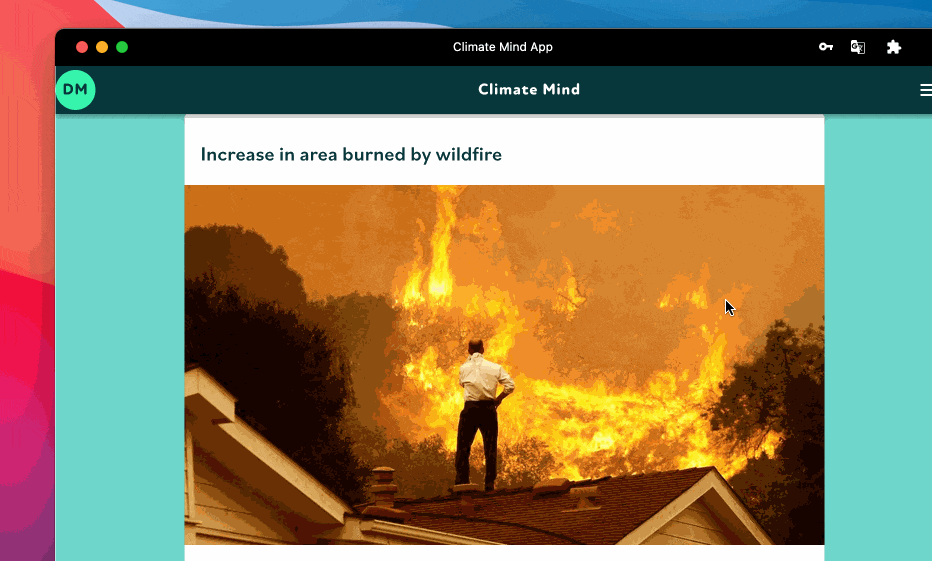

# 🏥 Adapt

Adaptation actions could be found in your personal feed.

The full list of adaptation actions could be found in our knowledge base:


[adaptation-actions.md](../knowledge-base/adaptation-actions.md)

