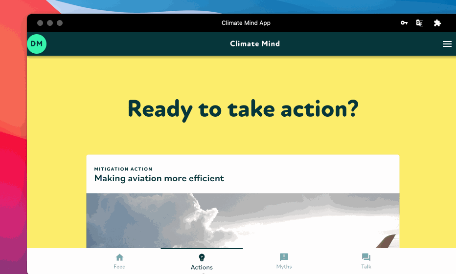

# ⏳ Mitigate

To check all available mitigation actions go to the "Actions" tab. You can also find mitigation actions in the feed per climate effect next to adaptation actions.&#x20;

&#x20;All mitigations actions are listed in our knowledge:


[mitigation-actions.md](../knowledge-base/mitigation-actions.md)

