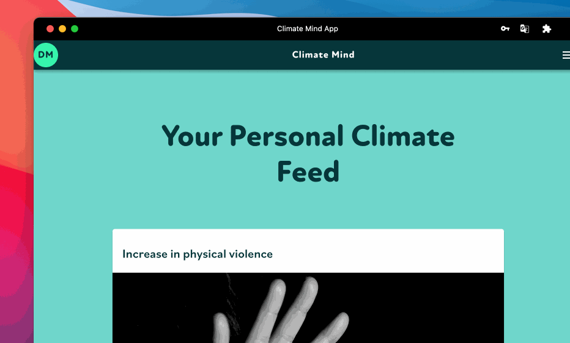

# 🌪 Climate impacts that affect you most

## Not a regular list of disasters

The problem is not a lack of information about climate change available to society, but an information connection and communication issue within society. This can be solved using a knowledge base that connects climate change impacts and solutions with geographic locations and personal values to enable a recommendation system that personalizes app experiences and improves climate conversations.

## Climate change effects

We generate a personalized climate feed for you based on your personal values and location zip code. It consists of climate change effects that will affect you the most.&#x20;

You can find the list of all climate change effects from our climate knowledge base in the article below:


[climate-change-effects.md](../knowledge-base/climate-change-effects.md)


The app shares the personal risks of climate change along with personally motivating climate actions.&#x20;
