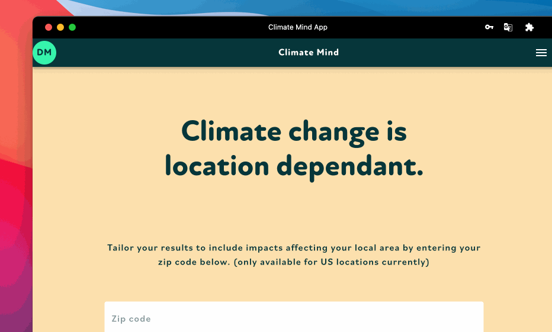

# 📬 Where you live matters


The local impacts feature is only available for US locations currently. If you don't live in the US or don't want local impacts indicated, click the `"don't use zip code"` button


## Climate Mind personalizes by using zip code

There are a variety of location-related data sets the app uses for this feature:

* US hurricane regions
* US extreme heat/heatwave areas
* US record heat
* US wildfire hazard potential
* US air pollution exposure

See our knowledge base article to learn more:


[local-impacts.md](../knowledge-base/local-impacts.md)


&#x20; Tailor your results to include impacts affecting your local area by entering your zip code.&#x20;


Your information won’t be shared with anyone and could be removed by your request.

