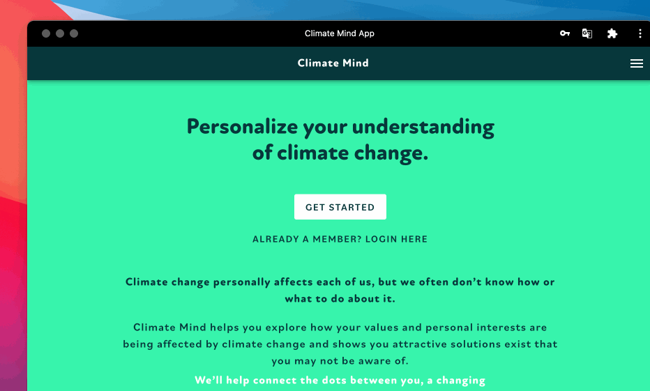

# 🏆 Your personal values

## Personalize your understanding of climate change

Climate Mind helps you explore how your values and personal interests are being affected by climate change and show you attractive solutions exist that you may not be aware of.

We’ll help connect the dots between you, a changing climate and actions you can take!

### What are personal values?

The Theory of Basic Human Values recognises ten universal values. You can find more information about all possible personal values and the research behind them below :arrow\_down:


[theory-of-basic-values.md](../knowledge-base/theory-of-basic-values.md)


### What are YOUR personal values?

#### Take the quiz

Respond to 10 statements based on these to find out your core values. There are 10 more optional statements which you can skip. Then view your results, learn how climate change affects you now and explore exciting solutions.

Read each statement and decide how much **you like** or **not like** that. Don’t worry! There are no right or wrong answers!

#### Discover your top 3 personal values

On the next page, you will see your quiz result - the top 3 of your personal values alongside your personal value web.

